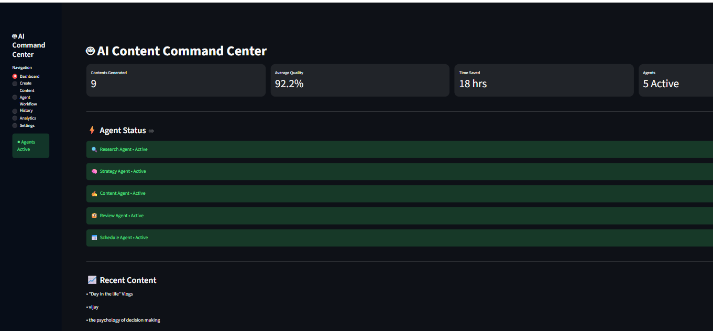
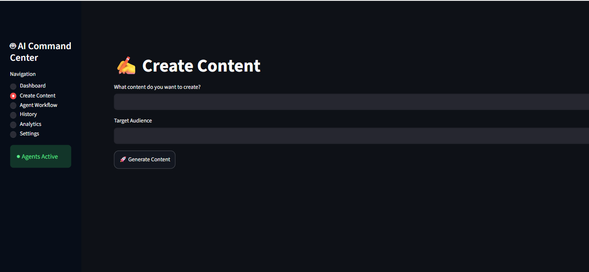
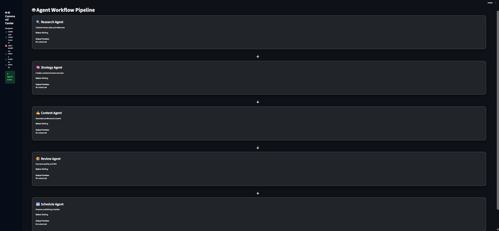
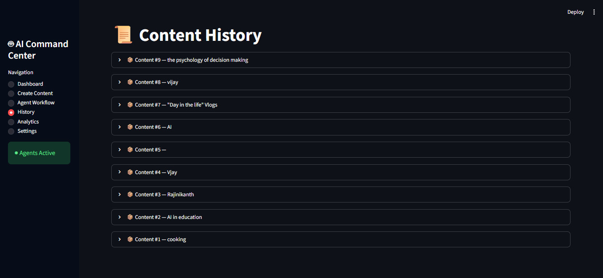
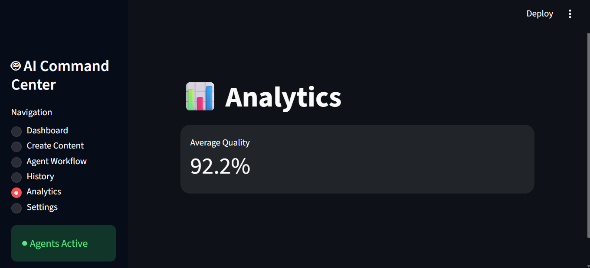

# 🤖 AI Content Command Center


A multi-agent AI content creation platform built with **Python** and **Streamlit**. The application automates the complete content creation workflow using specialized AI agents for research, strategy, content generation, review, and publishing schedule.

---

# 📌 Features

- 🔍 Research Agent
  - Collects topic-related information
  - Identifies key points for content

- 🧠 Strategy Agent
  - Creates a structured content strategy
  - Organizes the content flow

- ✍️ Content Agent
  - Generates AI-powered content
  - Produces readable draft content

- 🧐 Review Agent
  - Improves grammar and readability
  - Enhances content quality

- 📅 Schedule Agent
  - Suggests publishing schedules
  - Plans content release

- 📊 Dashboard
  - AI Agent status
  - Total content generated
  - Productivity metrics

- 📜 Content History
  - Stores previously generated content
  - Displays quality score
  - Tracks word count

- 📈 Analytics
  - Average quality score
  - Content generation statistics

---

# 🏗️ System Architecture

```
                User Input
                     │
                     ▼
          🔍 Research Agent
                     │
                     ▼
          🧠 Strategy Agent
                     │
                     ▼
           ✍️ Content Agent
                     │
                     ▼
           🧐 Review Agent
                     │
                     ▼
          📅 Schedule Agent
                     │
                     ▼
      Content + Analytics + History
```

---

# 📸 Application Screenshots

## Dashboard



---

## Create Content



---

## Agent Workflow



---

## History



---

## Analytics



---

# 🛠️ Tech Stack

- Python
- Streamlit
- JSON
- Git
- GitHub

---

# 📂 Project Structure

```
AI_Content_Agent_V1
│
├── app.py
├── requirements.txt
├── history.json
├── content_command_center.db
│
├── agents
│   ├── research_agent.py
│   ├── strategy_agent.py
│   ├── content_agent.py
│   ├── review_agent.py
│   └── schedule_agent.py
│
└── screenshots
```

---

# 🚀 Installation

Clone the repository

```bash
git clone https://github.com/dharanisri122008/AI_Content_Agent_V1.git
```

Go to the project folder

```bash
cd AI_Content_Agent_V1
```

Install dependencies

```bash
pip install -r requirements.txt
```

Run the application

```bash
streamlit run app.py
```

---

# 📈 Future Improvements

- AI image generation
- Social media platform integration
- SEO optimization
- Team collaboration
- AI chatbot assistant
- Cloud deployment
- Export to PDF and DOCX
- Content templates
- Multi-language support

---

# 👩‍💻 Author

**Dharani Sri**

GitHub: https://github.com/dharanisri122008

---

# ⭐ Support

If you found this project useful, consider giving it a ⭐ on GitHub!